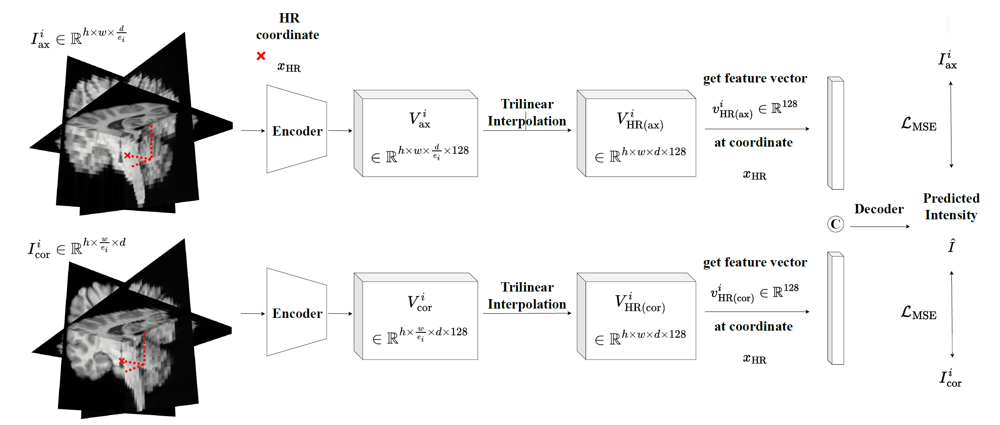
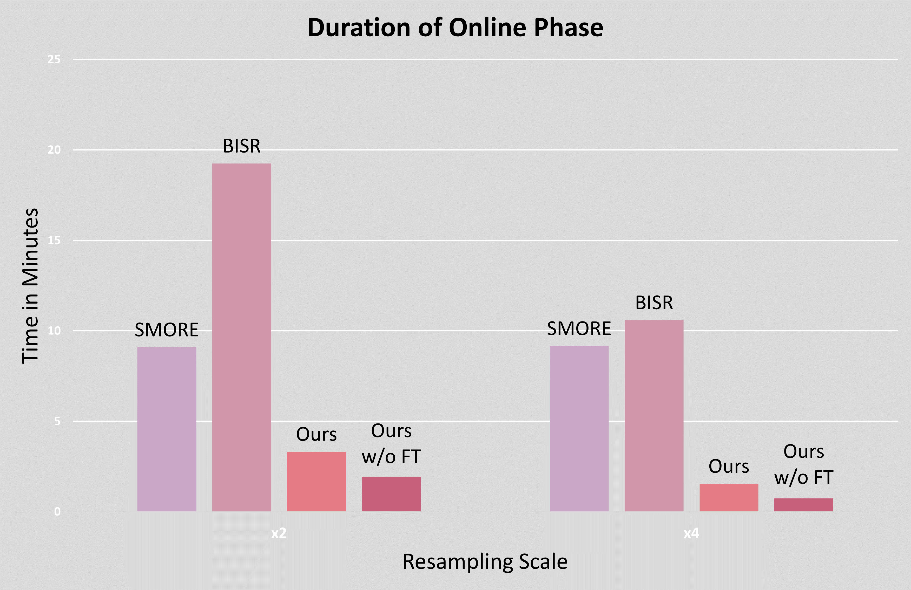

# Faster, Self-Supervised Super-Resolution for Anisotropic Multi-View MRI Using a Sparse Coordinate Loss

## ✨ Overview
In this study, we introduce **tripleSR**, a self-supervised method that fuses two anisotropic low-resolution MRI scans to reconstruct 
high-resolution images. Compared to state-of-the-art approaches, our method achieves a speed-up of up to 10× in patient-specific 
reconstruction while maintaining or improving image quality, making high-resolution MRI more practical for clinical use.
---

### Pre-print: [arXiv](https://arxiv.org/pdf/2509.07798), accepted by [MICCAI 2025](https://conferences.miccai.org/2025/en/default.asp).

---
## Network Architecture


**Figure 1:** Overview of our network architecture.

### Overview of our network architecture.

---
## 📊 SR Results

### Qualitative Results


**Figure 2:** Duration of the online phase for each method in minutes.


**Figure 3:** Reference HR image and qualitative SR results for all MR sequences in the sagittal plane of 
the BraTS test set where no in-plane HR images are available.

---

### Quantitative Results

| Resampling Scale |       |              | ×2             |               | ×4              |               |
|------------------|-------|--------------|----------------|---------------|-----------------|---------------|
|                  |       |              | PSNR ↑         | SSIM ↑        | PSNR ↑          | SSIM ↑        |
| BraTS            | T1 CE | cubic spline | 33.794 ± 2.408 | 0.981 ± 0.006 | 29.93 ± 2.285   | 0.945 ± 0.01  |
|                  |       | SMORE        | 37.939 ± 1.483 | 0.981 ± 0.003 | 30.678 ± 1.348  | 0.915 ± 0.009 |
|                  |       | BISR         | 42.727 ± 2.576 | 0.993 ± 0.003 | 35.008 ± 2.183  | 0.963 ± 0.007 |
|                  |       | Ours         | 43.166 ± 2.105 | 0.994 ± 0.001 | 35.598 ± 1.813  | 0.966 ± 0.005 |
|                  |       | Ours w/o FT  | 41.358 ± 2.701 | 0.993 ± 0.002 | 35.531 ± 1.4655 | 0.964 ± 0.004 |
|                  | T1    | cubic spline | 35.774 ± 3.745 | 0.991 ± 0.004 | 29.624 ± 3.629  | 0.962 ± 0.009 |
|                  |       | SMORE        | 34.333 ± 2.64  | 0.982 ± 0.003 | 26.627 ± 1.817  | 0.906 ± 0.008 |
|                  |       | BISR         | 39.003 ± 3.984 | 0.993 ± 0.006 | 31.078 ± 4.378  | 0.967 ± 0.017 |
|                  |       | Ours         | 38.832 ± 4.121 | 0.995 ± 0.002 | 31.169 ± 3.33   | 0.969 ± 0.006 |
|                  |       | Ours w/o FT  | 37.780 ± 4.061 | 0.993 ± 0.003 | 30.473 ± 3.632  | 0.965 ± 0.009 |
|                  | T2    | cubic spline | 33.890 ± 1.876 | 0.986 ± 0.004 | 30.643 ± 2.168  | 0.959 ± 0.014 |
|                  |       | SMORE        | 35.645 ± 1.388 | 0.984 ± 0.004 | 27.799 ± 1.217  | 0.91 ± 0.015  |
|                  |       | BISR         | 42.460 ± 1.853 | 0.997 ± 0.001 | 34.74 ± 1.661   | 0.976 ± 0.007 |
|                  |       | Ours         | 42.218 ± 1.75  | 0.997 ± 0.001 | 33.427 ± 1.64   | 0.973 ± 0.009 |
|                  |       | Ours w/o FT  | 40.531 ± 2.19  | 0.995 ± 0.002 | 33.073 ± 1.412  | 0.969 ± 0.008 |
| HCP              | T1    | cubic spline | 29.820 ± 3.785 | 0.982 ± 0.006 | 22.341 ± 3.947  | 0.93 ± 0.023  |
|                  |       | SMORE        | 30.603 ± 4.099 | 0.973 ± 0.007 | 22.533 ± 3.177  | 0.881 ± 0.019 |
|                  |       | BISR         | 31.249 ± 4.574 | 0.985 ± 0.007 | 22.758 ± 4.636  | 0.931 ± 0.034 |
|                  |       | Ours         | 34.140 ± 5.41  | 0.99 ± 0.004  | 23.301 ± 5.274  | 0.938 ± 0.025 |
|                  |       | Ours w/o FT  | 29.95 ± 4.655  | 0.984 ± 0.007 | 22.523 ± 4.86   | 0.933 ± 0.026 |
|                  | T2    | cubic spline | 30.561 ± 1.275 | 0.973 ± 0.004 | 27.336 ± 0.864  | 0.93 ± 0.008  |
|                  |       | SMORE        | 31.444 ± 0.814 | 0.967 ± 0.004 | 25.817 ± 0.597  | 0.877 ± 0.01  |
|                  |       | BISR         | 35.321 ± 0.858 | 0.985 ± 0.002 | 29.862 ± 0.531  | 0.947 ± 0.004 |
|                  |       | Ours         | 35.482 ± 0.877 | 0.986 ± 0.001 | 29.372 ± 1.231  | 0.941 ± 0.006 |
|                  |       | Ours w/o FT  | 34.841 ± 1.155 | 0.985 ± 0.002 | 29.681 ± 1.055  | 0.942 ± 0.006 |

Table 1: Quantitative results for all MR sequences and SR methods on the BraTS and the HCP test set (trained and 
evaluated on the same MR sequence). Best results are bold, second best underlined. 
“Ours w/o FT” refers to results without online training.
---

## ⚙️ Installation and Setup

### Dataset

🧠 We use the following publicly available datasets:  
- [BraTS 2019](https://www.kaggle.com/datasets/aryashah2k/brain-tumor-segmentation-brats-2019)  
- [Human Connectome Project (HCP)](https://db.humanconnectome.org/)  

### Setup
Clone this repository and navigate to the root directory of the project.

```bash
git clone https://github.com/MajaSchle/tripleSR.git
cd tripleSR
```

Run `pip install -r requirements.txt` to setup dependencies in your virtual enviroment.

✅ Tested with Python 3.9, PyTorch ≥ 1.11, CUDA ≥ 11.3.

### 🚀 Training

```bash
python train.py -hr_data_train /path/to/hr_lr_train_data \
                -hr_data_val /path/to/hr_lr_val_data
```

where,

- `hr_data_train`: path of HR (..._full-nii.gz)/LR (..._LR_ax.nii.gz/ ..._LR_cor.nii.gz) image pairs for training.
- `hr_data_val`: path of HR/LR image pairs for validation.

Checkpoints will be saved automatically in `./model/`.

### 🔍 Inference

```bash
python test.py -input_path /path/to/hr_lr_image_pairs \
               -output_path /path/to/save_sr \
               -pre_trained_model ./model/model.pth
```

where,

- `input_path`: path of LR input image pairs.
- `output_path`: path where the SR image is saved.
- `pre_trained_model`: path of pre-trained model weights.


### Acknowledgement

We thank all collaborators and contributors. \
This work builds upon [ Wu et al, 2023](https://ieeexplore.ieee.org/abstract/document/9954892) (https://github.com/iwuqing/ArSSR).


---

## 📖 Citation

If you find our work useful in your research, please cite:

```
@InProceedings{SchMaj_Faster_MICCAI2025,
        author = { Schlereth, Maja AND Schillinger, Moritz AND Breininger, Katharina},
        title = { { Faster, Self-Supervised Super-Resolution for Anisotropic Multi-View MRI Using a Sparse Coordinate Loss } },
        booktitle = {proceedings of Medical Image Computing and Computer Assisted Intervention -- MICCAI 2025},
        year = {2025},
        publisher = {Springer Nature Switzerland},
        volume = {LNCS 15962},
        month = {September},
        page = {172 -- 182}
```